# Images

## 20230503-1.png

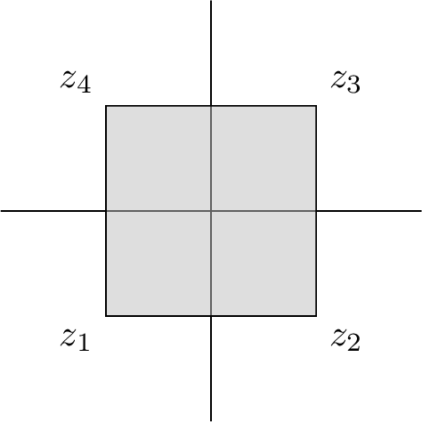

```tex
\documentclass{standalone}
\usepackage{tikz}
\usetikzlibrary{arrows,shapes,positioning,shadows,trees}

\begin{document}
\begin{tikzpicture}
  \draw[-] (-2,0) -- (2,0);
  \draw[-] (0,-2) -- (0,2);
  \fill[gray!50,opacity=0.5] (-1,-1) rectangle (1,1);
  \draw (-1,-1) rectangle (1,1);
  \node[anchor=north east] at (-1,-1) {$z_1$};
  \node[anchor=north west] at (1,-1) {$z_2$};
  \node[anchor=south west] at (1,1) {$z_3$};
  \node[anchor=south east] at (-1,1) {$z_4$};
\end{tikzpicture}
\end{document}
```

## 20230503-2.png

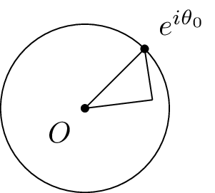

```tex
\documentclass{standalone}
\usepackage{tikz}
\usetikzlibrary{arrows,shapes,positioning,shadows,trees}

\begin{document}
\begin{tikzpicture}
  \draw (0,0) circle (1);
  \node[fill,circle,inner sep=1pt,label=below left:$O$] at (0,0) {};
  \node[fill,circle,inner sep=1pt,label=above right:$e^{i\theta_0}$] at (0.707,0.707) {};
  \draw (0,0) -- (0.707,0.707);
  \draw (0.707,0.707) -- (0.8,0.1);
  \draw (0,0) -- (0.8,0.1);
\end{tikzpicture}
\end{document}
```

## 20230511-1.png


```tex
\documentclass{standalone}
\usepackage{tikz}
\usetikzlibrary{arrows,shapes,positioning,shadows,trees}

\begin{document}
\begin{tikzpicture}
  \node (z) at (0,0) {
    \begin{tikzpicture}
      \fill[gray!50,opacity=0.5] (0,0) circle (1) -- (1,0) circle (2.5);
      \fill[white] (0,0) circle (0.99);
      \draw (0,0) circle (1);
      \node[anchor=north west] at (0.8,-0.6) {$\gamma_1$};
      \draw (1,0) circle (2.5);
      \node[anchor=north west] at (1 + 2.5 * 0.8, 0 - 2.5 * 0.6) {$\gamma_2$};
      \node[anchor=north east] at (0,0) {$O$};
      \node[anchor=south west] at (1,0) {$1$};
      \node[anchor=south west] at (3.5,0) {$\frac{7}{2}$};
      \node[anchor=north west] at (1.5,2) {$D$};
      \node[fill,circle,inner sep=1pt,label=above:$z_1$] at (-0.5,0) {};
      \node[fill,circle,inner sep=1pt,label=above:$z_2$] at (-2.0,0) {};
      \draw[-] (-2,0) -- (4,0);
      \draw[-] (0,-3.5) -- (0,3.5);
    \end{tikzpicture}
  };

  \node (f) at (z.east) [anchor=west, xshift=1cm] {
    \begin{tikzpicture}
      \draw[->] (0,0) -- (2,0);
      \node[anchor=south] at (1,0) {$f$};
    \end{tikzpicture}
  };

  \node (f_z) at (f.east) [anchor=west,xshift=1cm] {
    \begin{tikzpicture}
      \fill[gray!50,opacity=0.5] (0,0) circle (1) -- (0,0) circle (2.5);
      \fill[white] (0,0) circle (0.99);
      \draw (0,0) circle (1);
      \node[anchor=north west] at (0.8,-0.6) {$\Gamma_1$};
      \draw (0,0) circle (2.5);
      \node[anchor=north west] at (0 + 2.5 * 0.8, 0 - 2.5 * 0.6) {$\Gamma_2$};
      \node[fill,circle,inner sep=1pt,label=below left:$O$] at (0,0) {};
      \draw (0,0) -- (1,0);
      \node[anchor=north] at (0.5,-0.1) {$1$};
      \draw (0,0) -- (2.5 * 0.707, 2.5 * 0.707);
      \node[anchor=north west] at (2.5 * 0.707 / 2, 2.5 * 0.707 / 2) {$R$};
      \node[anchor=south] at (0,1.5) {$\widetilde{D}$};
    \end{tikzpicture}
  };
\end{tikzpicture}
\end{document}
```

## 20230511-2.png

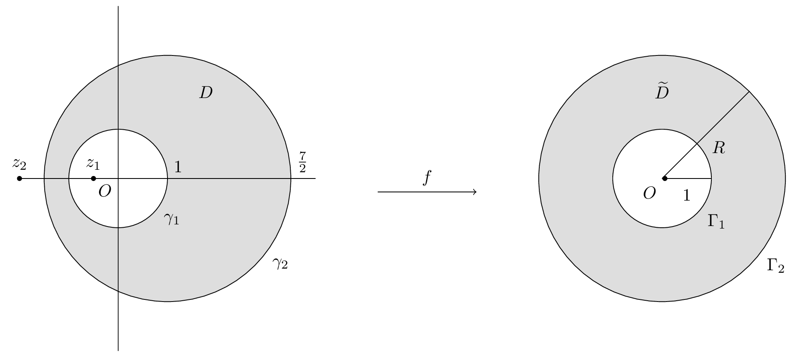

```tex
\documentclass{standalone}
\usepackage{tikz}
\usetikzlibrary{arrows,shapes,positioning,shadows,trees}

\begin{document}
\begin{tikzpicture}
  \node (z) at (0,0) {
    \begin{tikzpicture}
      \fill[gray!50,opacity=0.5] (0,0) circle (1) -- (1,0) circle (2.5);
      \fill[white] (0,0) circle (0.99);
      \draw (0,0) circle (1);
      \node[anchor=north west] at (0.8,-0.6) {$\gamma_1$};
      \draw (1,0) circle (2.5);
      \node[anchor=north west] at (1 + 2.5 * 0.8, 0 - 2.5 * 0.6) {$\gamma_2$};
      \node[anchor=north east] at (0,0) {$O$};
      \node[anchor=south west] at (1,0) {$1$};
      \node[anchor=south west] at (3.5,0) {$\frac{7}{2}$};
      \node[anchor=north west] at (1.5,2) {$D$};
      \node[fill,circle,inner sep=1pt,label=above:$z_1$] at (-0.5,0) {};
      \node[fill,circle,inner sep=1pt,label=above:$z_2$] at (-2.0,0) {};
      \draw[-] (-2,0) -- (4,0);
      \draw[-] (0,-3.5) -- (0,3.5);
    \end{tikzpicture}
  };

  \node (f) at (z.east) [anchor=west, xshift=1cm] {
    \begin{tikzpicture}
      \draw[->] (0,0) -- (2,0);
      \node[anchor=south] at (1,0) {$f$};
    \end{tikzpicture}
  };

  \node (f_z) at (f.east) [anchor=west,xshift=1cm] {
    \begin{tikzpicture}
      \fill[gray!50,opacity=0.5] (0,0) circle (1) -- (0,0) circle (2.5);
      \fill[white] (0,0) circle (0.99);
      \draw (0,0) circle (1);
      \node[anchor=north west] at (0.8,-0.6) {$\Gamma_1$};
      \draw (0,0) circle (2.5);
      \node[anchor=north west] at (0 + 2.5 * 0.8, 0 - 2.5 * 0.6) {$\Gamma_2$};
      \node[fill,circle,inner sep=1pt,label=below left:$O$] at (0,0) {};
      \draw (0,0) -- (1,0);
      \node[anchor=north] at (0.5,-0.1) {$1$};
      \draw (0,0) -- (2.5 * 0.707, 2.5 * 0.707);
      \node[anchor=north west] at (2.5 * 0.707 / 2, 2.5 * 0.707 / 2) {$R$};
      \node[anchor=south] at (0,1.5) {$\widetilde{D}$};
    \end{tikzpicture}
  };
\end{tikzpicture}
\end{document}
```

## 20230511-3.png


```tex
\documentclass{standalone}
\usepackage{tikz}
\usetikzlibrary{arrows,shapes,positioning,shadows,trees}

\begin{document}
\begin{tikzpicture}
  \node(z) at (0,0) {
    \begin{tikzpicture}
      \draw (0,0) circle (1);
      \node[fill,circle,inner sep=1pt,label=below:$O$] at (0,0) {};
    \end{tikzpicture}
  };

  \node(f) at (z.east) [anchor=west, xshift=0.3cm] {
    \begin{tikzpicture}
      \draw[->] (0,0) -- (2,0);
      \node[anchor=south] at (1,0) {$f$};
    \end{tikzpicture}
  };

  \node(f_z) at (f.east) [anchor=west, xshift=0.3cm] {
    \begin{tikzpicture}
      \fill[gray!50,opacity=0.5] (-2,-2) rectangle (3,2);
      \draw[->] (-2,0) -- (3,0);
      \draw[->] (0,-2) -- (0,2);
      \node[fill,circle,inner sep=1pt,label=below right:$O$] at (0,0) {};
      \node[anchor=south west] at (-1,1) {$D$};
      \node[fill,circle,inner sep=1pt,label=below right:$2A$] at (2,0) {};
      \draw[->] (1,-2) -- (1,-0.2);
      \draw[-] (1,-0.2) -- (1,2);
    \end{tikzpicture}
  };

  \node(phi) at (f_z.south) [anchor=north, yshift=-0.3cm] {
    \begin{tikzpicture}
      \draw[->] (0,0) -- (0,-2);
      \node[anchor=west] at (0,-1) {$\phi$};
    \end{tikzpicture}
  };

  \node(phi_f_z) at (phi.south) [anchor=north, yshift=-0.3cm] {
    \begin{tikzpicture}
      \draw (0,0) circle (1);
      \node[fill,circle,inner sep=1pt,label=below:$O$] at (0,0) {};
    \end{tikzpicture}
  };
  \draw[->] (z) -- (phi_f_z);
\end{tikzpicture}
\end{document}
```

## 20230523.png


```tex
\documentclass{standalone}
\usepackage{tikz}
\usetikzlibrary{arrows,shapes,positioning,shadows,trees}

\begin{document}
\begin{tikzpicture}
    \draw[-] (-3,0) -- (3,0);
    \node[fill,circle,inner sep=1pt,label=below:$O$] at (0,0) {};
    \node[fill,circle,inner sep=1pt,label=below:$-R$] at (-2,0) {};
    \node[fill,circle,inner sep=1pt,label=below:$R$] at (2,0) {};
    \draw[->] (2,0) arc (0:180:2);
    \node[label=above right:$\gamma_R$] at (2*0.6,2*0.8) {};
    \draw[->] (2*0.6 + 0.1 * 0.8, 2*0.8 - 0.1 * 0.6)-- (2*0.6,2*0.8);
\end{tikzpicture}

\begin{tikzpicture}
    \draw[-] (-3,0) -- (3,0);
    \node[fill,circle,inner sep=1pt,label=below:$O$] at (0,0) {};
    \node[fill,circle,inner sep=1pt,label=below:$-R$] at (-2,0) {};
    \node[fill,circle,inner sep=1pt,label=below:$R$] at (2,0) {};
    \draw[->] (2,0) arc (0:180:2);
    \node[label=above right:$\gamma_R$] at (2*0.6,2*0.8) {};
    \draw[->] (2*0.6 + 0.1 * 0.8, 2*0.8 - 0.1 * 0.6)-- (2*0.6,2*0.8);
    \node[fill,circle,inner sep=1pt,label=right:$i$] at (0,1) {};
\end{tikzpicture}

\begin{tikzpicture}
    \draw[-] (-4,0) -- (4,0);
    \node[fill,circle,inner sep=1pt,label=below:$O$] at (0,0) {};
    \node[fill,circle,inner sep=1pt,label=below:$-R$] at (-3,0) {};
    \node[fill,circle,inner sep=1pt,label=below:$R$] at (3,0) {};
    \draw[->] (0,0) -- (0,2.5);
    \node[fill,circle,inner sep=1pt,label=right:$i\pi$] at (0,1) {};
    \node[fill,circle,inner sep=1pt,label=above right:$2i\pi$] at (0,2) {};
    \draw[->] (3,0) -- (3,1);
    \draw[-] (3,1) -- (3,2);
    \node[label=above right:$\gamma_1$] at (3,1) {};
    \draw[->] (3,2) -- (2,2);
    \draw[-] (2,2) -- (-3,2);
    \node[label=above right:$\gamma_2$] at (2,2) {};
    \draw[->] (-3,2) -- (-3,1);
    \draw[-] (-3,1) -- (-3,0);
    \node[label=above left:$\gamma_3$] at (-3,1) {};
\end{tikzpicture}

\begin{tikzpicture}
    \draw[-] (-3,0) -- (3,0);
    \node[fill,circle,inner sep=1pt,label=below:$O$] at (0,0) {};
    \node[fill,circle,inner sep=1pt,label=below:$-R$] at (-2,0) {};
    \node[fill,circle,inner sep=1pt,label=below:$R$] at (2,0) {};
    \draw[->] (2,0) arc (0:180:2);
    \node[label=above right:$\gamma_R$] at (2*0.6,2*0.8) {};
    \draw[->] (2*0.6 + 0.1 * 0.8, 2*0.8 - 0.1 * 0.6)-- (2*0.6,2*0.8);
    \node[fill,circle,inner sep=1pt,label=below:$-\epsilon$] at (-0.5,0) {};
    \node[fill,circle,inner sep=1pt,label=below:$\epsilon$] at (0.5,0) {};
    \draw[->] (0.5,0) arc (0:180:0.5);
    \node[label=above right:$\gamma_\epsilon$] at (0.5*0.6,0.5*0.8) {};
    \draw[->] (0.5*0.6,0.5*0.8) -- (0.5*0.6 + 0.05*0.8, 0.5*0.8 - 0.05*0.6);
\end{tikzpicture}
\end{document}
```

## 20230525.png

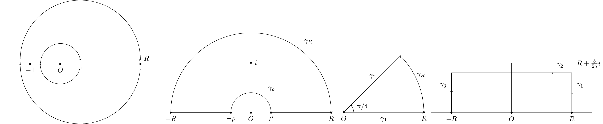

```tex
\documentclass{standalone}
\usepackage{tikz}
\usetikzlibrary{arrows,shapes,positioning,shadows,trees}

\begin{document}
\begin{tikzpicture}
    \draw[-] (-3,0) -- (5,0);
    \node[fill,circle,inner sep=1pt,label=below:$O$] at (0,0) {};
    \draw[->] (4,0.2) arc (0:185:3);
    \draw[->] (-2,0) arc (180:355:3);
    \draw[<-] (1,0.2) arc (10:180:1);
    \draw[<-] (-1,0) arc (180:350:1);

    \node[fill,circle,inner sep=1pt,label=below:$-1$] at (-1.5,0) {};
    \node[fill,circle,inner sep=1pt,label=above right:$R$] at (4,0) {};
    \draw[->] (1,0.2) -- (4,0.2);
    \draw[<-] (1,-0.2) -- (4,-0.2);
\end{tikzpicture}

\begin{tikzpicture}
    \node[fill,circle,inner sep=1pt,label=below:$O$] at (0,0) {};
    \draw[<-] (1,0) arc (0:180:1);
    \draw[->] (1,0) -- (4,0);
    \draw[<-] (-1,0) -- (-4,0);
    \draw[<-] (4,0) arc (0:180:4);
    \node[fill,circle,inner sep=1pt,label=below:$-\rho$] at (-1,0) {};
    \node[fill,circle,inner sep=1pt,label=below:$\rho$] at (1,0) {};
    \node[fill,circle,inner sep=1pt,label=below:$-R$] at (-4,0) {};
    \node[fill,circle,inner sep=1pt,label=below:$R$] at (4,0) {};
    \node[label=above right:$\gamma_R$] at (4 * 0.6,4 * 0.8) {};
    \node[label=above right:$\gamma_\rho$] at (1 * 0.6,1 * 0.8) {};
    \node[fill,circle,inner sep=1pt,label=right:$i$] at (0,2.5) {};
\end{tikzpicture}


\begin{tikzpicture}
    \draw[->] (0,0) -- (4,0);
    \node[fill,circle,inner sep=1pt,label=below:$O$] at (0,0) {};
    \node[fill,circle,inner sep=1pt,label=below:$R$] at (4,0) {};
    \node[label=below:$\gamma_1$] at (2,0) {};
    \draw[->] (4,0) arc (0:45:4);
    \node[label=above right:$\gamma_R$] at (3.4, 1.5) {};
    \draw[->] (4 * 0.72,4*0.72) -- (0,0);
    \node[label=above:$\gamma_2$] at (2 * 0.72, 2 * 0.72) {};
    \draw[->] (0.5,0) arc (0:45:0.5);
    \node[label=right:$\pi/4$] at (0.5 * 0.8, 0.5 * 0.6) {};
\end{tikzpicture}

\begin{tikzpicture}
    \draw[-] (-4,0) -- (4,0);
    \node[fill,circle,inner sep=1pt,label=below:$O$] at (0,0) {};
    \node[fill,circle,inner sep=1pt,label=below:$-R$] at (-3,0) {};
    \node[fill,circle,inner sep=1pt,label=below:$R$] at (3,0) {};
    \draw[->] (0,0) -- (0,2.5);
    \draw[->] (3,0) -- (3,1);
    \draw[-] (3,1) -- (3,2);
    \node[label=above right:$\gamma_1$] at (3,1) {};
    \draw[->] (3,2) -- (2,2);
    \draw[-] (2,2) -- (-3,2);
    \node[label=above right:$\gamma_2$] at (2,2) {};
    \draw[->] (-3,2) -- (-3,1);
    \draw[-] (-3,1) -- (-3,0);
    \node[label=above left:$\gamma_3$] at (-3,1) {};
    \node[label=above right:$R+\frac{b}{2a}i$] at (3,2) {};
\end{tikzpicture}
\end{document}
```

## 20230603.png

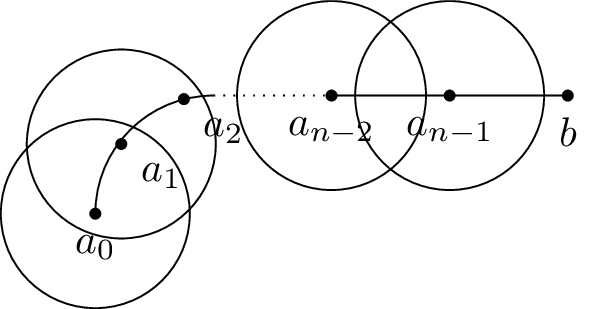

```tex
\documentclass{standalone}
\usepackage{tikz}
\usetikzlibrary{arrows,shapes,positioning,shadows,trees}

\begin{document}
\begin{tikzpicture}
    \draw (-1,0) arc (180:90:1);
    \draw[dotted] (0,1) -- (1,1);
    \draw (1,1) -- (3,1);
    \node[fill,circle,inner sep=1pt,label=below:$a_0$] at (-1,0) {};
    \node[fill,circle,inner sep=1pt,label=below right:$a_1$] at (-0.78,0.59) {};
    \node[fill,circle,inner sep=1pt,label=below right:$a_2$] at (-0.25,0.97) {};
    \node[fill,circle,inner sep=1pt,label=below:$a_{n-2}$] at (1,1) {};
    \node[fill,circle,inner sep=1pt,label=below:$a_{n-1}$] at (2,1) {};
    \node[fill,circle,inner sep=1pt,label=below:$b$] at (3,1) {};
    \draw (-1, 0) circle (0.8);
    \draw (-0.78, 0.59) circle (0.8);
    \draw (1, 1) circle (0.8);
    \draw (2, 1) circle (0.8);
\end{tikzpicture}
\end{document}
```

## 20230609-1.png

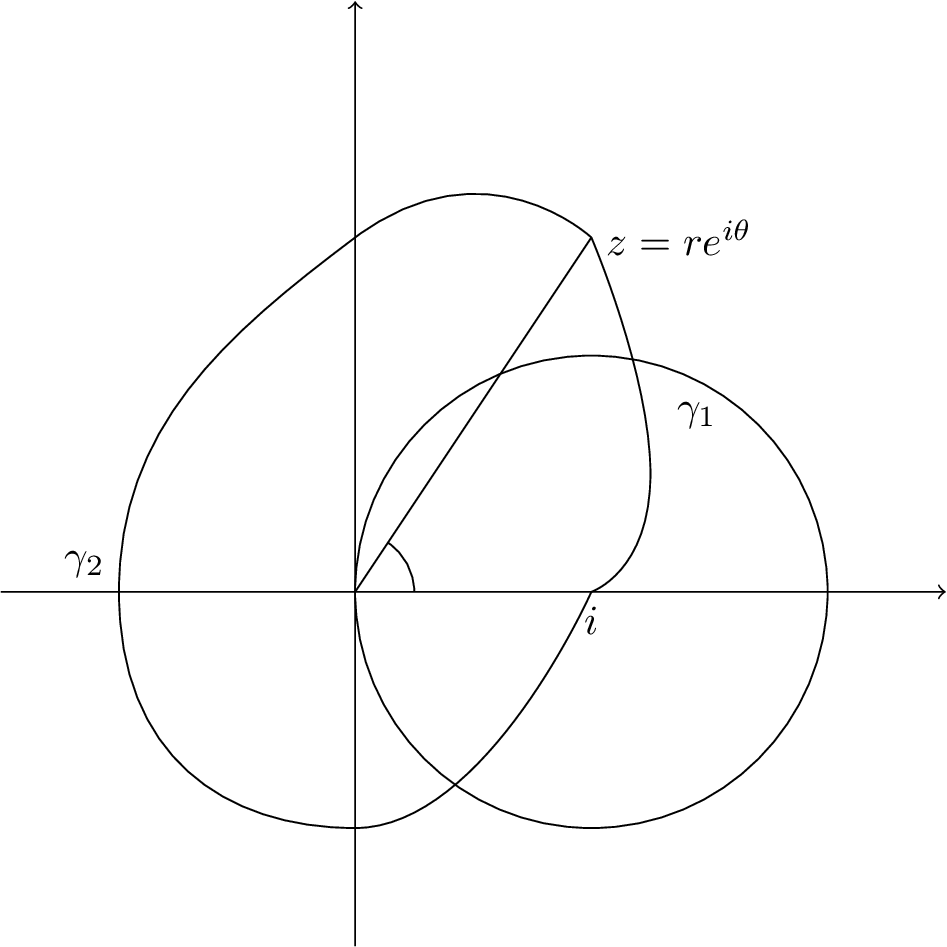

```tex
\documentclass{standalone}
\usepackage{amsmath}
\usepackage{amsfonts}
\usepackage{tikz}
\usetikzlibrary{arrows,shapes,positioning,shadows,trees}

\begin{document}
\begin{tikzpicture}
    \draw[->] (-3,0) -- (5,0);
    \draw[->] (0,-3) -- (0,5);
    \draw (2,0) circle (2);
    \draw[-] (0,0) -- (2,3);
    \draw[-] (0.5,0) arc (0:56.3:0.5);
    \node[right] at (2,3) {$z = r e^{i \theta}$};
    \draw [-] plot [smooth, tension=1] coordinates {(2,0) (2.5,1) (2,3)};
    \node[right] at (2.6,1.5) {$\gamma_1$};
    \node[below] at (2,0) {$i$};
    \draw [-] plot [smooth, tension=1] coordinates {(2,0) (0,-2) (-2,0) (0,3) (2,3)};
    \node[above left] at (-2,0) {$\gamma_2$};
\end{tikzpicture}
\end{document}
```

## 20230609-2.png

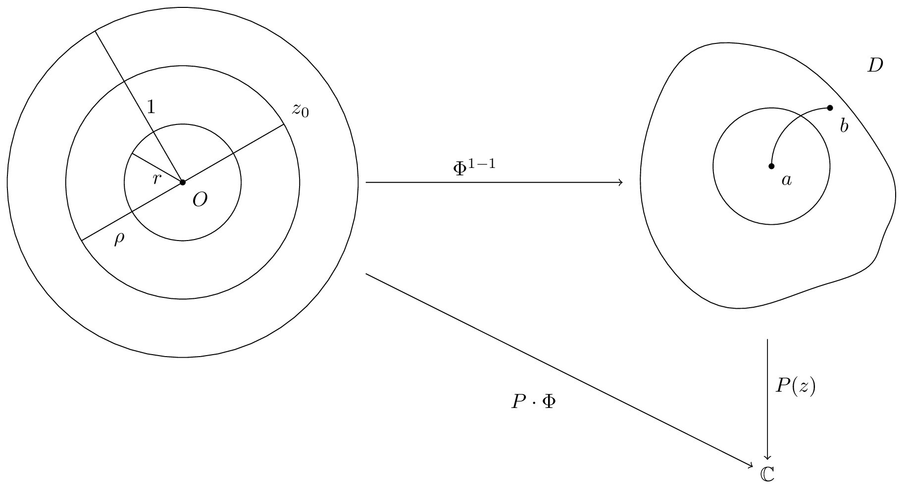

```tex
\documentclass{standalone}
\usepackage{amsmath}
\usepackage{amsfonts}
\usepackage{tikz}
\usetikzlibrary{arrows,shapes,positioning,shadows,trees}

\begin{document}
\begin{tikzpicture}
    \node (a) at (0,0) {
        \begin{tikzpicture}
            \draw (0,0) circle (1);
            \draw (0,0) circle (2);
            \draw (0,0) circle (3);
            \draw[-] (0,0) -- (1.732,1);
            \node[above right] at (1.732,1) {$z_0$};
            \draw[-] (0,0) -- (-1.732,-1);
            \node[fill,circle,inner sep=1pt,label=below right:$O$] at (0,0) {};
            \node[below right] at (-1.732 * 3 / 4, - 3 / 4) {$\rho$};
            \draw[-] (0,0) -- (-1.732 / 2, 0.5);
            \node[below] at (-1.732 / 4, 0.25) {$r$};
            \draw[-] (0,0) -- (-0.5 * 3, 1.732 * 3 / 2);
            \node[right] at (-0.5 * 3 / 2, 1.732 * 3 / 4) {$1$};
        \end{tikzpicture}
    };

    \node (b) at (10,0) {
        \begin{tikzpicture}
            \draw (0,0) circle (1);
            \draw [-] plot [smooth, tension=1] coordinates {(2,0) (0,2) (-2,1) (-1.5,-2) (1,-2) (2,-1) (2,0)};
            \node[fill,circle,inner sep=1pt,label=below right:$a$] at (0,0) {};
            \node[fill,circle,inner sep=1pt,label=below right:$b$] at (1,1) {};
            \draw[-] (0,0) arc (180:90:1);
            \node[above right] at (1.5, 1.5) {$D$};
        \end{tikzpicture}
    };

    \node(c) at (10, -5) {$\mathbb C$};
    \draw[->] (a) -- (b);
    \node[above] at (5,0) {$\Phi^{1-1}$};
    \draw[->] (a) -- (c);
    \node[below] at (6,-3.5) {$P\cdot \Phi$};
    \draw[->] (b) -- (c);
    \node[right] at (10, -3.5) {$P(z)$};
\end{tikzpicture}
\end{document}
```

## 20230611-1.png

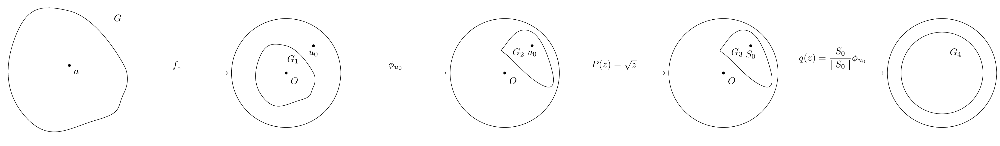

```tex
\documentclass{standalone}
\usepackage{amsmath}
\usepackage{amsfonts}
\usepackage{tikz}
\usetikzlibrary{arrows,shapes,positioning,shadows,trees}

\begin{document}
\begin{tikzpicture}
    \node (a) at (0,0) {
        \begin{tikzpicture}
            \node[fill,circle,inner sep=1pt,label=below right:$a$] at (0,0) {};
            \draw [-] plot [smooth, tension=1] coordinates {(2,0) (0,2) (-2,1) (-1.5,-2) (1,-2) (2,-1) (2,0)};
            \node[above right] at (1.5, 1.5) {$G$};
        \end{tikzpicture}
    };


    \node (b) at (8,0) {
        \begin{tikzpicture}
            \draw (0,0) circle (2);
            \draw [-] plot [smooth, tension=1] coordinates {(1,0) (0,1) (-1,0.5) (-0.75,-1) (0.5,-1) (1,-0.5) (1,0)};
            \node[fill,circle,inner sep=1pt,label=below right:$O$] at (0,0) {};
            \node[fill,circle,inner sep=1pt,label=below:$u_0$] at (1,1) {};
            \node at (0.25, 0.5) {$G_1$};
        \end{tikzpicture}
    };

    \node(c) at (16, 0) {
        \begin{tikzpicture}
            \draw (0,0) circle (2);
            \draw [-] plot [smooth, tension=1] coordinates {(1.75,0) (1,1.5) (0,1) (0.25,0.5) (1.5,-0.5) (1.75,0)};
            \node[fill,circle,inner sep=1pt,label=below right:$O$] at (0,0) {};
            \node[fill,circle,inner sep=1pt,label=below:$u_0$] at (1,1) {};
            \node at (0.5, 0.75) {$G_2$};
        \end{tikzpicture}
    };

    \node(d) at (24, 0) {
        \begin{tikzpicture}
            \draw (0,0) circle (2);
            \draw [-] plot [smooth, tension=1] coordinates {(1.75,0) (1,1.5) (0,1) (0.25,0.5) (1.5,-0.5) (1.75,0)};
            \node[fill,circle,inner sep=1pt,label=below right:$O$] at (0,0) {};
            \node[fill,circle,inner sep=1pt,label=below:$S_0$] at (1,1) {};
            \node at (0.5, 0.75) {$G_3$};
        \end{tikzpicture}
    };

    \node(e) at (32, 0) {
        \begin{tikzpicture}
            \draw (0,0) circle (2);
            \draw (0,0) circle (1.5);
            \node at (0.5, 0.75) {$G_4$};
        \end{tikzpicture}
    };

    \draw[->] (a) -- (b);
    \node[above] at (4,0) {$f_{*}$};

    \draw[->] (b) -- (c);
    \node[above] at (12,0) {$\phi_{u_0}$};

    \draw[->] (c) -- (d);
    \node[above] at (20, 0) {$P(z) = \sqrt{z}$};

    \draw[->] (d) -- (e);
    \node[above] at (28, 0) {$q(z) = \dfrac{S_0}{\mid S_0 \mid} \phi_{u_0}$};
\end{tikzpicture}
\end{document}
```

## 20230611-2.png

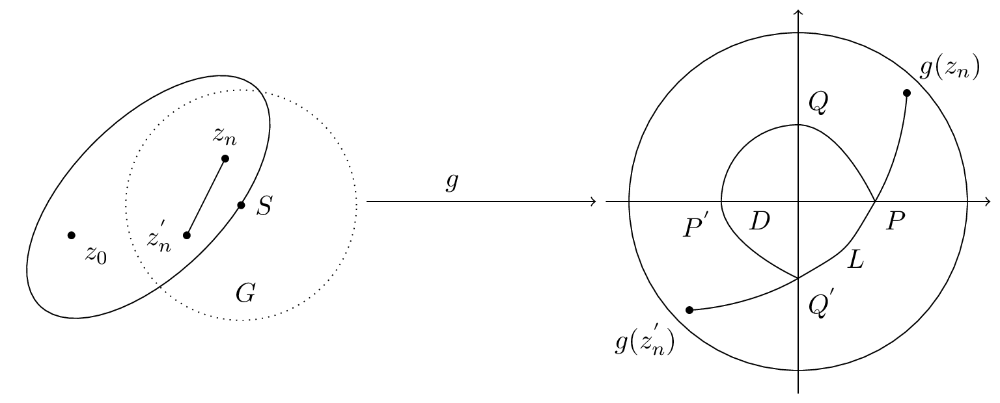

```tex
\documentclass{standalone}
\usepackage{amsmath}
\usepackage{amsfonts}
\usepackage{tikz}
\usetikzlibrary{arrows,shapes,positioning,shadows,trees}

\begin{document}
\begin{tikzpicture}
    \node (a) at (0,0) {
        \begin{tikzpicture}
            \draw (0,0) [rotate=45] ellipse (2cm and 1cm);
            \node[below right] at (1, -1) {$G$};
            \node[fill,circle,inner sep=1pt,label=below right:$z_0$] at (-1,-0.5) {};
            \node[fill,circle,inner sep=1pt,label=above:$z_n$] at (1,0.5) {};
            \node[fill,circle,inner sep=1pt,label=left:$z_n^{'}$] at (0.5,-0.5) {};
            \draw[-] (0.5,-0.5) -- (1,0.5);
            \node[fill,circle,inner sep=1pt,label=right:$S$] at (1.414 / 2 + 0.5, - 1.414 / 2 + 0.6) {};
            \draw[dotted] (1.414 / 2 + 0.5, - 1.414 / 2 + 0.6) circle (1.5);
        \end{tikzpicture}
    };

    \node (b) at (8,0) {
        \begin{tikzpicture}
            \draw (0,0) circle (2.2);
            \draw[->] (-2.5,0) -- (2.5,0);
            \draw[->] (0,-2.5) -- (0,2.5);
            \node[fill,circle,inner sep=1pt,label=above right:$g(z_n)$] at (1.414, 1.414) {};
            \node[fill,circle,inner sep=1pt,label=below left:$g(z_n^{'})$] at (-1.414, -1.414) {};
            \draw [-] plot [smooth, tension=1] coordinates {(1,0) (0,1) (-1,0) (0,-1)};
            \draw [-] plot [smooth, tension=1] coordinates {(1.414, 1.414) (1,0) (0,-1) (-1.414, -1.414)};
            \node[below right] at (1,0) {$P$};
            \node[below left] at (-1,0) {$P^{'}$};
            \node[above right] at (0,1) {$Q$};
            \node[below right] at (0,-1) {$Q^{'}$};
            \node[below] at (-0.5,0) {$D$};
            \node[below] at (0.75,-0.5) {$L$};

        \end{tikzpicture}
    };

    \draw[->] (a) -- (b);
    \node[above] at (3.5,0) {$g$};
\end{tikzpicture}
\end{document}
```

## 20230613.png


```tex
\documentclass{standalone}
\usepackage{amsmath}
\usepackage{amsfonts}
\usepackage{tikz}
\usetikzlibrary{arrows,shapes,positioning,shadows,trees}

\begin{document}
\begin{tikzpicture}
    \draw [-] (0,0) -- (2.5,0) -- (3,1) -- (2,2) -- (3,3) -- (1,4) -- (-0.5, 2) -- (0,0);
    \draw (0.3,0) arc (0:100:0.3);
    \node[above right] at (0.2,0.1) {$\alpha_k \pi$};
    \node[below] at (0,0) {$w_k$};
    \node[below] at (2,0) {$(0<\alpha_k<2)$};
\end{tikzpicture}
\end{document}
```

## 20230614-1.png

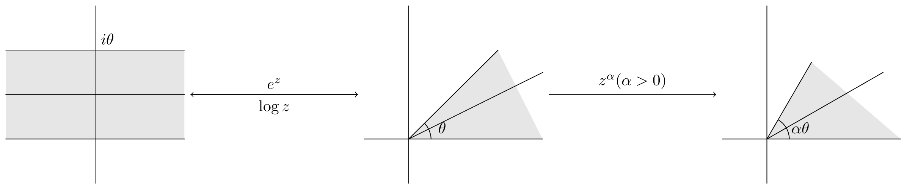

```tex
% example tikz figure

\documentclass{standalone}
\usepackage{amsmath}
\usepackage{tikz}
\usetikzlibrary{arrows,shapes,positioning,shadows,trees}

\begin{document}
\begin{tikzpicture}
    \node (a) at (0,0) {
        \begin{tikzpicture}
            \filldraw[fill=gray!20,draw=white] (-2,1) rectangle (2,-1);
            \draw[-] (-2,0) -- (2,0);
            \draw[-] (0,-2) -- (0,2);
            \draw[-] (-2,1) -- (2,1);
            \draw[-] (-2,-1) -- (2,-1);
            \node[anchor=south west] at (0,1) {$i\theta$};
        \end{tikzpicture}
    };

    \node (b) at (8,0) {
        \begin{tikzpicture}
            \filldraw[fill=gray!20,draw=white] (0,0) -- (2,2) -- (3,0) -- (0,0);
            \draw[-] (-1,0) -- (3,0);
            \draw[-] (0,-1) -- (0,3);
            \draw[-] (0,0) -- (2,2);
            \draw[-] (0,0) -- (3,1.5);
            \draw (0.5,0) arc (0:45:0.5);
            \node at (0.75,0.25) {$\theta$};
        \end{tikzpicture}
    };

    \node (c) at (16,0) {
        \begin{tikzpicture}
            \filldraw[fill=gray!20,draw=white] (0,0) -- (1,1.732) -- (3,0) -- (0,0);
            \draw[-] (-1,0) -- (3,0);
            \draw[-] (0,-1) -- (0,3);
            \draw[-] (0,0) -- (1,1.732);
            \draw[-] (0,0) -- (1.732 * 1.5,1 * 1.5);
            \draw (0.5,0) arc (0:60:0.5);
            \node at (0.75,0.25) {$\alpha\theta$};
        \end{tikzpicture}
    };

    \draw[->] (a) -- (b) node[midway,above] {$e^z$};
    \draw[->] (b) -- (a) node[midway,below] {$\log z$};
    \draw[->] (b) -- (c) node[midway,above] {$z^{\alpha} (\alpha > 0)$};
\end{tikzpicture}
\end{document}
```

## 20230614-2.png

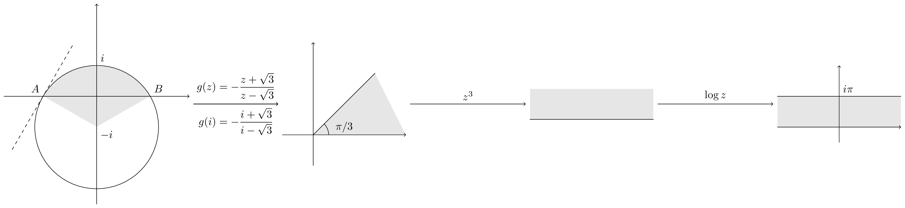

```tex
\documentclass{standalone}
\usepackage{amsmath}
\usepackage{tikz}
\usetikzlibrary{arrows,shapes,positioning,shadows,trees}


\begin{document}
\begin{tikzpicture}
    \node (a) at (0,0) {
        \begin{tikzpicture}
            \filldraw[fill=gray!20,draw=white] (0,-1) -- (1.732, 0) arc (30:150:2) -- (0,-1);
            \draw[->] (-3,0) -- (3,0);
            \draw[->] (0,-3.5) -- (0,3);
            \draw (0,-1) circle (2);
            \node[anchor=north west] at (0,-1) {$-i$};
            \node[anchor=south west] at (0,1) {$i$};
            \node[anchor=south west] at (1.732,0) {$B$};
            \node[anchor=south east] at (-1.732,0) {$A$};
            \draw[dashed] (-1.732 - 1, -1.732) -- (-1.732 + 1, 1.732);
        \end{tikzpicture}
    };

    \node (b) at (8,0) {
        \begin{tikzpicture}
            \filldraw[fill=gray!20,draw=white] (0,0) -- (2,2) -- (3,0) -- (0,0);
            \draw[->] (-1,0) -- (3,0);
            \draw[->] (0,-1) -- (0,3);
            \draw[-] (0,0) -- (2,2);
            \draw (0.5,0) arc (0:45:0.5);
            \node at (1,0.25) {$\pi / 3$};
        \end{tikzpicture}
    };

    \node (c) at (16,0) {
        \begin{tikzpicture}
            \filldraw[fill=gray!20,draw=white] (-2,0) -- (2,0) -- (2,1) -- (-2,1) -- (-2,0);
            \draw[-] (-2,0) -- (2,0);
        \end{tikzpicture}
    };

    \node (d) at (24,0) {
        \begin{tikzpicture}
            \filldraw[fill=gray!20,draw=white] (-2,1) rectangle (2,0);
            \draw[->] (-2,0) -- (2,0);
            \draw[->] (0,-0.5) -- (0,2);
            \draw[-] (-2,1) -- (2,1);
            \node[anchor=south west] at (0,1) {$i\pi$};
        \end{tikzpicture}
    };

    \draw[->] (a) -- (b) node[midway,above] {$g(z) = - \dfrac{z+\sqrt{3}}{z-\sqrt{3}}$};
    \draw[->] (a) -- (b) node[midway,below] {$g(i) = - \dfrac{i+\sqrt{3}}{i-\sqrt{3}}$};
    \draw[->] (b) -- (c) node[midway,above] {$z^3$};
    \draw[->] (c) -- (d) node[midway,above] {$\log z$};
\end{tikzpicture}
\end{document}
```

## 20230614-3.png

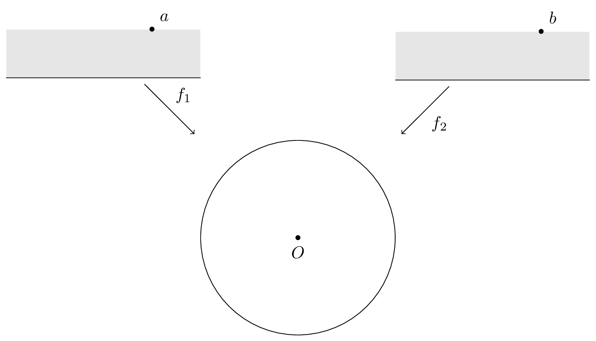

```tex
\documentclass{standalone}
\usepackage{amsmath}
\usepackage{tikz}
\usetikzlibrary{arrows,shapes,positioning,shadows,trees}

\begin{document}
\begin{tikzpicture}
    \node (a) at (0,0) {
        \begin{tikzpicture}
            \filldraw[fill=gray!20,draw=white] (-2,0) -- (2,0) -- (2,1) -- (-2,1) -- (-2,0);
            \draw[-] (-2,0) -- (2,0);
        \node[fill,circle,inner sep=1pt,label=above right:$a$] at (1,1) {};
        \end{tikzpicture}
    };

    \node (b) at (8,0) {
        \begin{tikzpicture}
            \filldraw[fill=gray!20,draw=white] (-2,0) -- (2,0) -- (2,1) -- (-2,1) -- (-2,0);
            \draw[-] (-2,0) -- (2,0);
        \node[fill,circle,inner sep=1pt,label=above right:$b$] at (1,1) {};
        \end{tikzpicture}
    };

    \node (c) at (4,-4) {
        \begin{tikzpicture}
            \draw (0,0) circle (2);
            \node[fill,circle,inner sep=1pt,label=below:$O$] at (0,0) {};
        \end{tikzpicture}
    };

    \draw[->] (a) -- (c) node[midway,above right] {$f_1$};
    \draw[->] (b) -- (c) node[midway,below right] {$f_2$};
\end{tikzpicture}
\end{document}
```

## 20230617-1.png

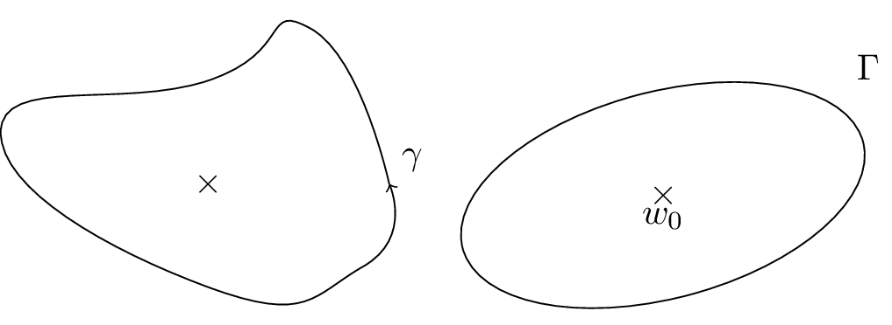

```tex
\documentclass{standalone}
\usepackage{amsmath}
\usepackage{amsfonts}
\usepackage{tikz}
\usetikzlibrary{arrows,shapes,positioning,shadows,trees}

\begin{document}
\begin{tikzpicture}
    \draw[-] (0,0) -- (0,0) node[anchor=center] {$\times$};
    \draw [->] plot [smooth, tension=1, circle] coordinates {(1.75,0) (1,1.5) (0,1) (-2,0.5) (0,-1) (1.5,-0.8) (1.75,0)};
    \node[above right] at (1.75,0) {$\gamma$};
\end{tikzpicture}
\begin{tikzpicture}
    \draw[-] (0,0) -- (0,0) node[anchor=center] {$\times$};
    \node[below] at (0,0) {$w_0$};
    \draw (0,0) [rotate=15] ellipse (2cm and 1cm);
    \node[above right] at (1.75,1) {$\Gamma$};
\end{tikzpicture}
\end{document}
```

## 20230617-2.png

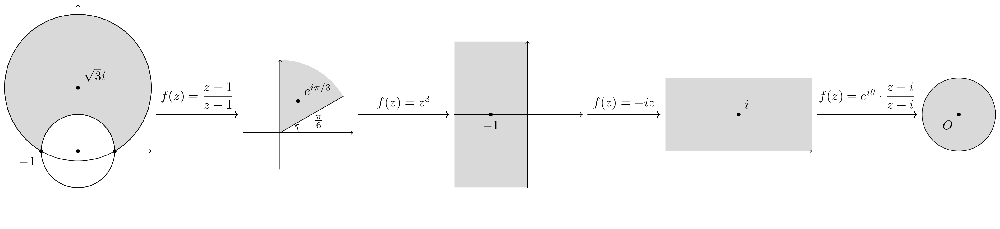

```tex
\documentclass{standalone}
\usepackage{amsmath}
\usepackage{amsfonts}
\usepackage{tikz}
\usetikzlibrary{arrows,shapes,positioning,shadows,trees}

\begin{document}
\begin{tikzpicture}
    \node (a) at (0,0) {
        \begin{tikzpicture}
            \filldraw[fill=gray!30, draw=black] (0,1.732) circle (2);
            \filldraw[fill=white, draw=black] (0,0) circle (1);
            \draw[->] (-2,0) -- (2,0);
            \draw[->] (0,-2) -- (0,4);
            \draw (0,0) circle (1);
            \draw (0,1.732) circle (2);
            \node[fill,circle,inner sep=1pt,label=above right:$\sqrt{3}i$] at (0,1.732) {};
            \node[fill,circle,inner sep=1pt,label=below left:$-1$] at (-1,0) {};
            \node[fill,circle,inner sep=1pt] at (0,0) {};
            \node[fill,circle,inner sep=1pt] at (1,0) {};
        \end{tikzpicture}
    };

    \node(b) at (6,0) {
        \begin{tikzpicture}
            \filldraw[fill=gray!30, draw=white!0] (0,0) -- (1.732,1) arc (30:90:2) -- (0,0);
            \draw[->] (-1,0) -- (2,0);
            \draw[->] (0,-1) -- (0,2);
            \draw[-] (0,0) -- (1.732, 1);
            \draw[->] (0.5,0) arc (0:30:0.5);
            \node[above right] at (0.8,0) {$\frac{\pi}{6}$};
            \node[fill,circle,inner sep=1pt,label=above right:$e^{i\pi/3}$] at (1 / 2,1.732 / 2) {};
        \end{tikzpicture}
    };

    \node (c) at (12,0) {
        \begin{tikzpicture}
            \filldraw[fill=gray!30, draw=white!0] (-2,2) -- (-2,-2) -- (0,-2) -- (0,2) -- (-2,2);
            \draw[->] (-2,0) -- (1.5,0);
            \draw[->] (0,-2) -- (0,2);
            \node[fill,circle,inner sep=1pt,label=below:$-1$] at (-1,0) {};
        \end{tikzpicture}
    };

    \node (d) at (18,0) {
        \begin{tikzpicture}
            \filldraw[fill=gray!30, draw=white!0] (-2,2) -- (-2,0) -- (2,0) -- (2,2) -- (-2,2);
            \draw[->] (-2,0) -- (2,0);
            \node[fill,circle,inner sep=1pt,label=above right:$i$] at (0,1) {};
        \end{tikzpicture}
    };

    \node (e) at (24,0) {
        \begin{tikzpicture}
            \filldraw[fill=gray!30] (0,0) circle (1);
            \node[fill,circle,inner sep=1pt,label=below left:$O$] at (0,0) {};
        \end{tikzpicture}
    };

    \draw[->,thick] (a) -- (b) node[midway,above] {$f(z) = \dfrac{z+1}{z-1}$};
    \draw[->,thick] (b) -- (c) node[midway,above] {$f(z) = z^3$};
    \draw[->,thick] (c) -- (d) node[midway,above] {$f(z) = -iz$};
    \draw[->,thick] (d) -- (e) node[midway,above] {$f(z) = e^{i\theta}\cdot\dfrac{z-i}{z+i}$};
\end{tikzpicture}

\end{document}
```

